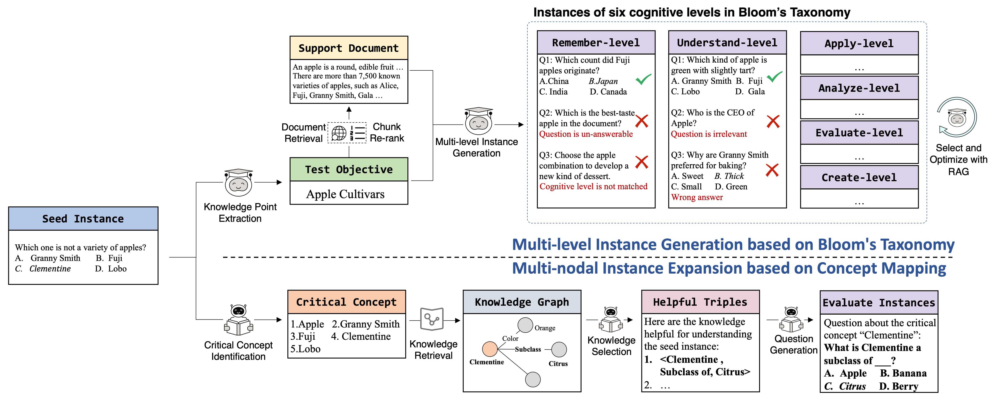

# 📚 About

This is the source code for building a structured assessment guided by pedagogy theories to evaluate model ability for each test objective across multiple cognitive levels and critical concepts, rather than relying on the correctness of a single test instance. Specifically, StructEval consists of two modules which deepen and broaden current evaluation respectively.
Given a seed instance, the first module identifies its underlying test objective, and then generates multiple test instances around this test objective which are aligned with the six cognitive levels outlined in Bloom’s Taxonomy. 
Meanwhile, the second module extracts the key concepts that must be understood to answer the seed question, and then develop a series of instances revolving around these concepts.



# 🔥  Quick Start

## 💻 Environment Preparation

* unpack the environment file
```bash
mkdir ~/anaconda3/envs/structeval
tar -xzvf asset/structeval.tar.gz -C ~/anaconda3/envs/structeval
```

* check installation
```bash
conda info -e
conda activate structeval
```

* Edit the OPENAI API keys in [common_utils/constant.py](common_utils/constant.py)

## 📂 Data Preparation
Convert your data to the following format and name it as `0_{split}_with_idx.json`, then place it in the `processed_data/{benchmark_name}` folder.

If the benchmark consists of multiple sub-tasks, place the json file in `processed_data/{benchmark_name}/{task_name}`

```json
{"question": "Which of the following is true regarding reflexes?", "subject": "clinical_knowledge", "choices": ["A positive babinski reflex is the same as a normal flexor response in the assessment of the plantar reflex", "An extensor plantar response indicates a lower motor neurone lesion", "The root value of the ankle reflex is S1", "The root value of the knee reflex is L1, L2"], "answer": 2, "idx": 0}
```

We also prepared an example in [processed_data/demo](processed_data/demo) to facilitate your usage. A complete running example can be found in [processed_data/example](processed_data/example).

> If you want to run the code completely, you also need to build the ElasticSearch index for Wikipedia. Please refer to `Notes` for details.

## 🔨 Structured Benchmark Generation

### 1. Bloom-based Generation

The following script would first identify the underlying test objective of each test instance and then generates multiple relevant instances covering six cognitive levels of Bloom’s Taxonomy. 

```bash
bash scripts/run_bloom_generate.bash {benchmark_name} {split}
```
For instance,
```bash
bash scripts/run_bloom_generate.bash demo test
```

### 2. Concept-based Generation

The following script would extract the essential concepts that must be understood and develops a series of extended questions around these concepts.

```bash
bash scripts/run_concept_generation.bash demo test
```

### 3. Data Combine

The following script would combine the generated test instances from the above two modules.

```bash
bash scripts/run_data_combine.bash demo test
```

If everything goes smoothly, you can find the generated structural benchmark under the [struct_data/demo](struct_data/demo) folder, and you can see all the intermediate process data under the [processed_data/demo](processed_data/demo) folder.

We also provided a complete running example in [processed_data/example](processed_data/example), so that you can easily check the results in each step.


## 📒 Notes

* Due to our discovery that the information in Wikipedia is richer compared to Wikidata, it can lead to generating higher quality questions. Therefore, in this version of the code, concept-related instances are generated based on Wikipedia, which differs from what is mentioned in the paper.

* Due to the need to retrieve the text of Wikipedia for generation, we have built a regularly updated ElasticSearch Index for retrieval. Because its scale, we are unable to share the original ES index in this repository, so please set up the corresponding ES index in your environment and configure it as follows, then edit `config/es_config.yaml` accordingly. If you encounter any problems during this process, feel free to communicate with us.

```json
{
  "wikipedia-monthly-enwiki" : {
    "mappings" : {
      "properties" : {
        "id" : {
          "type" : "text",
        },
        "text" : {
          "type" : "text",
        },
        "title" : {
          "type" : "text",
        },
        "url" : {
          "type" : "text",
        }}}}
}
```


